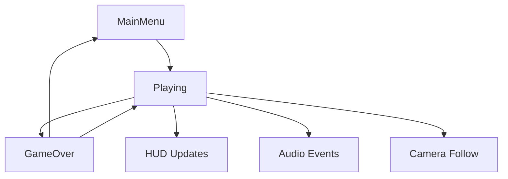

# 🏗️ Архитектура WorldOfBalance

## 🎯 Общая структура проекта

**WorldOfBalance** теперь имеет профессиональную модульную архитектуру с четким разделением ответственности между компонентами.

---

## 📁 Структура папок

### **Assets/Game/** - Основные ресурсы игры
```
Assets/Game/
├── Scripts/
│   ├── Managers/          # Менеджеры систем
│   │   └── GameManager.cs # Центральный контроллер состояний
│   ├── UI/                # Интерфейс пользователя
│   │   ├── HUDManager.cs  # HUD с здоровьем/броней
│   │   └── SettingsManager.cs # Настройки игры
│   ├── Audio/             # Аудио система
│   │   └── AudioManager.cs # Звуки и музыка
│   ├── Camera/            # Камера
│   │   └── CameraController.cs # Следование за игроком
│   ├── Tank/              # Танки и управление
│   │   ├── TankController.cs   # Основной контроллер танка
│   │   ├── PlayerController.cs # Управление игроком
│   │   └── TankSetupHelper.cs  # Настройка танков
│   └── Weapons/           # Оружие и снаряды
│       ├── BulletController.cs # Новая система снарядов
│       ├── Weapon.cs          # Оружие танка
│       ├── Bullet.cs          # Старая система (совместимость)
│       ├── Projectile.cs      # Альтернативные снаряды
│       └── TankBullet.cs      # Специальные снаряды
├── Prefabs/           # Префабы игровых объектов
├── UI/                # UI префабы и материалы
└── Audio/             # Звуковые файлы
```

### **Assets/Scenes/** - Сцены игры
```
Assets/Scenes/
├── MainMenu.unity     # Главное меню
├── Levels/            # Игровые уровни
│   └── TankDuel.unity # Основная арена
└── TestScene.unity    # Тестовая сцена
```

---

## 🎮 Архитектура компонентов

### **🎯 GameManager** - Центральная система
```csharp
namespace WorldOfBalance.Managers

/// Состояния игры:
- MainMenu   # Главное меню
- Playing    # Игровой процесс  
- GameOver   # Завершение игры

/// Функции:
- StartGame()        # Начать игру
- EndGame(winner)    # Завершить с победителем
- RestartGame()      # Перезапуск
- ReturnToMainMenu() # Возврат в меню
```

### **🎵 AudioManager** - Звуковая система
```csharp
namespace WorldOfBalance.Audio

/// Возможности:
- PlaySFX(name)      # Звуковые эффекты
- PlayMusic(name)    # Фоновая музыка
- OnTankFire()       # Звук выстрела
- OnBulletHit()      # Звук попадания
- OnBulletBounce()   # Звук рикошета
- OnTankDestroyed()  # Звук уничтожения
```

### **📷 CameraController** - Управление камерой
```csharp
namespace WorldOfBalance.Camera

/// Функции:
- SetTarget(tank)           # Установить цель
- SetBoundaries(min, max)   # Границы камеры
- SnapToTarget()            # Мгновенное следование
- ToggleProjectionMode()    # 2D/3D режим
```

### **📊 HUDManager** - Пользовательский интерфейс
```csharp
namespace WorldOfBalance.UI

/// Отображает:
- Здоровье танка (полоска + текст)
- Броня танка (полоска + значение)
- Боеприпасы (∞ или количество)
- Время игры (MM:SS)
- Счет игрока
```

### **⚙️ SettingsManager** - Настройки игры
```csharp
namespace WorldOfBalance.UI

/// Настройки:
- Громкость музыки/эффектов
- Чувствительность мыши
- Инверсия Y-оси
- Разрешение экрана
- Полноэкранный режим
- Качество графики
```

---

## 🔧 Системы и их взаимодействие

### **Игровой цикл:**


### **Событийная система:**
```csharp
// GameManager события
OnStateChanged.Invoke(newState)
OnGameOver.Invoke(winner)

// Аудио события (автоматические)
tank.Fire() -> AudioManager.OnTankFire()
bullet.Hit() -> AudioManager.OnBulletHit()
```

---

## 🎯 Ключевые особенности архитектуры

### **✅ Модульность**
- Каждая система изолирована в своем namespace
- Четкое разделение ответственности
- Легко добавлять новые компоненты

### **✅ Singleton менеджеры**
```csharp
GameManager.Instance    # Состояние игры
AudioManager.Instance   # Звуки
```

### **✅ Автоматическое связывание**
- HUDManager находит игрока автоматически
- CameraController подключается к Player
- AudioManager интегрируется с оружием

### **✅ Настраиваемость**
- Все параметры выведены в Inspector
- Сохранение настроек в PlayerPrefs
- Debug режимы для отладки

### **✅ Обратная совместимость**
- Старые скрипты работают с новыми
- Fallback системы для разных типов снарядов
- Поддержка множественных контроллеров

---

## 📚 XML Документация

Все новые классы содержат полную XML документацию:

```csharp
/// <summary>
/// Центральный менеджер игры, управляющий состояниями и игровым циклом.
/// Отвечает за переходы между MainMenu, Playing, GameOver состояниями.
/// </summary>
/// <param name="newState">Новое состояние</param>
/// <returns>Успешность операции</returns>
```

---

## 🚀 Расширение системы

### **Добавление новых уровней:**
1. Создать сцену в `Assets/Scenes/Levels/`
2. Добавить в GameManager.gameSceneName
3. Система загрузки работает автоматически

### **Добавление новых звуков:**
1. Добавить AudioClip в AudioManager
2. Добавить в PopulateAudioDictionary()
3. Вызывать через PlaySFX(name)

### **Добавление UI элементов:**
1. Создать в HUDManager новые поля
2. Подключить через Inspector
3. Обновлять в UpdateHUD()

---

## 🎮 Готовые компоненты для использования

### **Основные менеджеры:** ✅
- GameManager (состояния игры)
- AudioManager (звуки)
- HUDManager (интерфейс)
- SettingsManager (настройки)
- CameraController (камера)

### **Танковая система:** ✅
- TankController (основной)
- PlayerController (игрок)
- BulletController (снаряды без физики)
- TankSetupHelper (автонастройка)

### **Структура проекта:** ✅
- Организованные папки
- Namespace разделение
- Документация XML
- Meta файлы

**WorldOfBalance готов к профессиональной разработке!** 🚗💥🎯