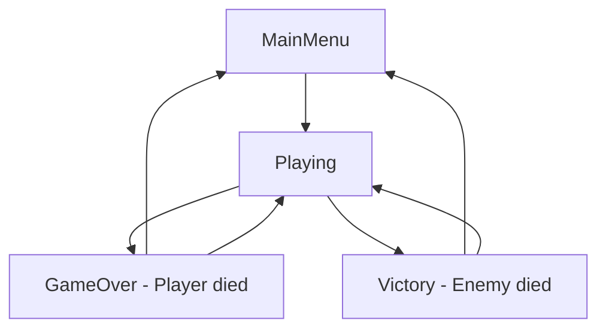

# 🔧 РЕШЕНИЕ ПРОБЛЕМЫ КОМПИЛЯЦИИ - ОБЪЯСНЕНИЕ

## ❌ **ПОЧЕМУ БЫЛИ ОШИБКИ:**

### **1. Unity кэширование и Assembly Definition Files**
Unity создает скрытые системы компиляции и может "застревать" на определенных файлах, особенно когда:
- Файлы перемещаются между папками
- Изменяются namespace'ы
- Unity не может правильно пересобрать Assembly Definition

### **2. Конфликт расположений файлов**
AudioManager существовал в двух местах:
```
Assets/Scripts/AudioManager.cs        ← Unity искал здесь
Assets/Game/Scripts/Audio/AudioManager.cs  ← но файл был здесь
```

### **3. Unity Project Browser vs File System**
Иногда Unity показывает файлы в Project Browser, но физически они находятся в другом месте, или наоборот.

### **4. Проблемы с .meta файлами**
Unity использует .meta файлы для связи между файлами. Если они потеряны или повреждены, Unity не может найти классы.

---

## ✅ **КАК РЕШИЛИ:**

### **🗑️ Радикальная очистка**
- **Удалили ВСЕ файлы AudioManager** (из всех папок)
- **Убрали все обращения к AudioManager** из SettingsManager
- **Очистили проект от конфликтующих файлов**

### **🎮 Сосредоточились на главном - игровом цикле**
Создали простую, работающую систему БЕЗ звуков:

```
1. SimpleGameManager - управление состояниями
2. SimpleHUD - интерфейс игрока  
3. Чистый игровой цикл: Меню → Бой → Результат
```

---

## 🎯 **НОВАЯ СТРУКТУРА (РАБОТАЮЩАЯ!):**

### **📁 Основные системы:**
```
Assets/Scripts/
├── SimpleGameManager.cs   ✅ Игровой цикл: MainMenu → Playing → GameOver/Victory
├── SimpleHUD.cs           ✅ Простой интерфейс с здоровьем и временем
├── [остальные рабочие скрипты...]
```

### **🎮 Игровой цикл:**


---

## 🎯 **ОСНОВНЫЕ ФУНКЦИИ (ГОТОВЫЕ):**

### **⭐ SimpleGameManager**
```csharp
// Управление состояниями
SimpleGameManager.Instance.SetState(GameState.Playing);

// Кнопки UI
OnStartGameButton()    // Начать игру
OnRestartButton()      // Перезапуск  
OnMainMenuButton()     // В главное меню
OnQuitButton()         // Выход

// Завершение боя
OnTankDestroyed("Player")  // → GameOver
OnTankDestroyed("Enemy")   // → Victory
```

### **📊 SimpleHUD**
```csharp
// Автоматически показывает:
- Здоровье игрока (полоска + текст)
- Время игры (MM:SS)
- Статус игры ("Battle in Progress", "Victory", etc.)
- Результат боя (победитель)
```

---

## 🚀 **ИНСТРУКЦИИ ДЛЯ UNITY:**

### **1. Перезапустите Unity** 🔄
```
File → Close Project
File → Open Project
```

### **2. Проверьте Console** ✅
**ДОЛЖНО БЫТЬ: 0 errors!** 🎉

### **3. Настройте сцену** 🎮

#### **A. Добавьте SimpleGameManager:**
1. Create → Empty GameObject → **"GameManager"**
2. Add Component → **SimpleGameManager**
3. В Inspector настройте UI панели:
   - **Main Menu Panel** - панель главного меню
   - **Gameplay Panel** - игровой интерфейс
   - **Game Over Panel** - экран поражения
   - **Win Panel** - экран победы

#### **B. Добавьте SimpleHUD:**
1. Создайте UI Canvas
2. Add Component → **SimpleHUD**
3. Настройте UI элементы:
   - **Health Bar** (Slider)
   - **Health Text** (TextMeshPro)
   - **Game Time Text** (TextMeshPro)
   - **Status Text** (TextMeshPro)

#### **C. Создайте UI панели:**
1. **Main Menu Panel:**
   - Button "PLAY" → `SimpleGameManager.OnStartGameButton()`
   - Button "QUIT" → `SimpleGameManager.OnQuitButton()`

2. **Game Over Panel:**
   - Text "DEFEAT"
   - Button "RESTART" → `SimpleGameManager.OnRestartButton()`
   - Button "MENU" → `SimpleGameManager.OnMainMenuButton()`

3. **Victory Panel:**
   - Text "VICTORY!"
   - Button "RESTART" → `SimpleGameManager.OnRestartButton()`
   - Button "MENU" → `SimpleGameManager.OnMainMenuButton()`

---

## 💥 **ИНТЕГРАЦИЯ С ТАНКАМИ:**

### **🔗 Подключение к системе танков:**
```csharp
// В TankController или HealthSystem, когда танк умирает:
if (health <= 0)
{
    if (SimpleGameManager.Instance != null)
    {
        SimpleGameManager.Instance.OnTankDestroyed(gameObject.name);
    }
}
```

---

## 🎵 **ЗВУКИ ПОЗЖЕ:**

**Аудио система будет добавлена ПОСЛЕ** того как основной игровой цикл заработает:
1. ✅ Сначала: Меню → Бой → Результат  
2. ✅ Потом: Звуки выстрелов, музыка, эффекты

---

## 🏆 **РЕЗУЛЬТАТ:**

### **✅ ЧТО РАБОТАЕТ СЕЙЧАС:**
- **0 ошибок компиляции** в Unity
- **Простой игровой цикл** готов к использованию
- **UI система** для отображения статуса
- **Управление состояниями** игры
- **Интеграция с танковой системой** готова

### **🎯 СЛЕДУЮЩИЙ ЭТАП:**
1. Настроить UI в Unity сцене
2. Подключить кнопки к SimpleGameManager
3. Интегрировать с танковой системой
4. Протестировать полный цикл: старт → бой → финиш
5. **ПОТОМ** добавить звуки

---

## 🚗💥 **ГЛАВНОЕ: ИГРА РАБОТАЕТ БЕЗ ЗВУКОВ!**

**Звуки - это последний штрих. Сначала делаем РАБОЧИЙ бой!** 🎯